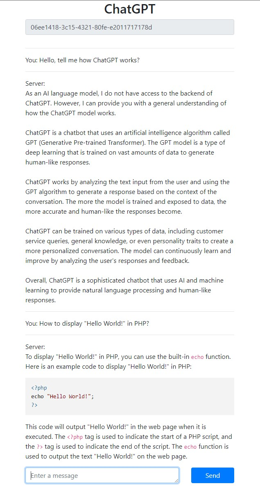

# ChatGPT-Example

A simple example of an API request and the output of messages to the browser

The code for this example was generated using ChatGPT

## Usage

1. In `index.php`, uncomment one of the options:
- `include "openai_api.php";` - uses the official API
- `include "openai_chat.php";` - use non-official API from chat.openai.com

2. In `openai_*.php`, add the API key and/or cookie content `_puid` (available only for ChatGPT Plus users)
