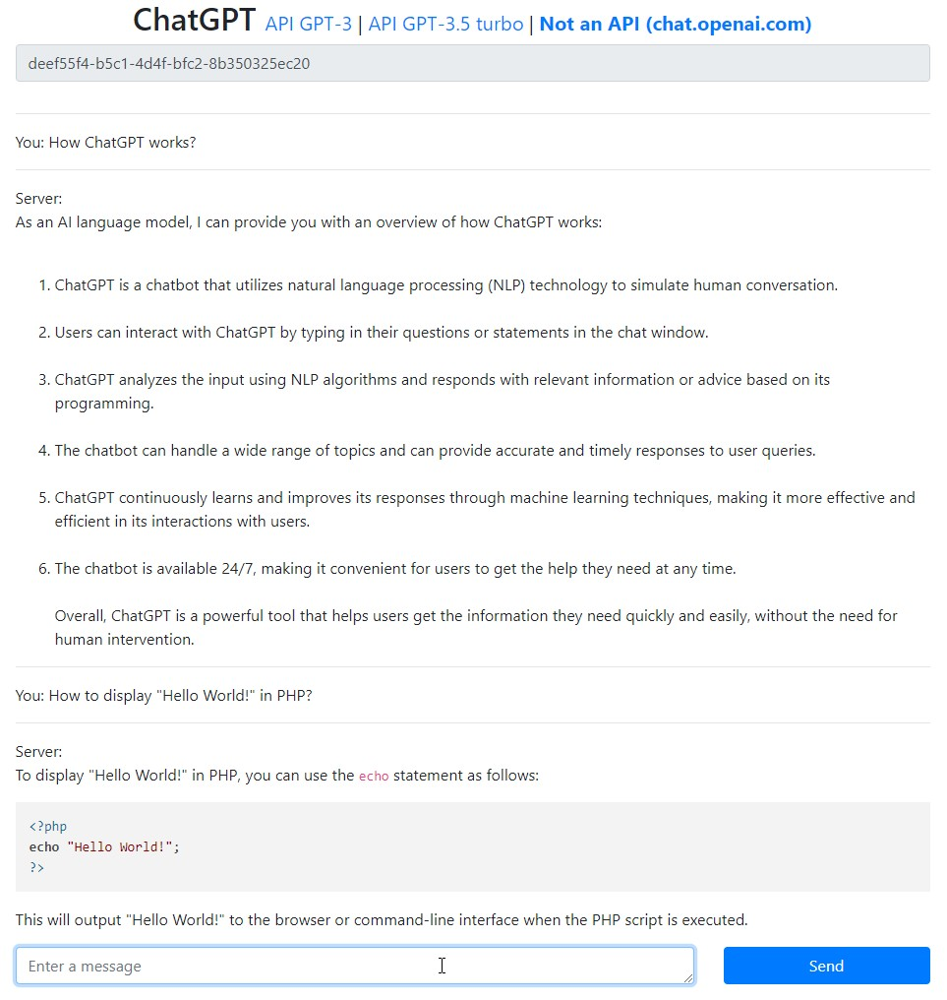
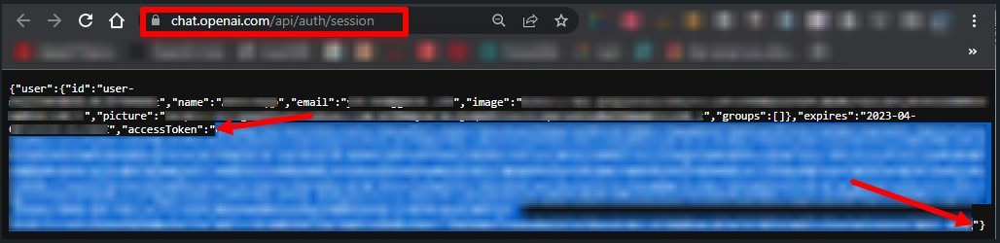
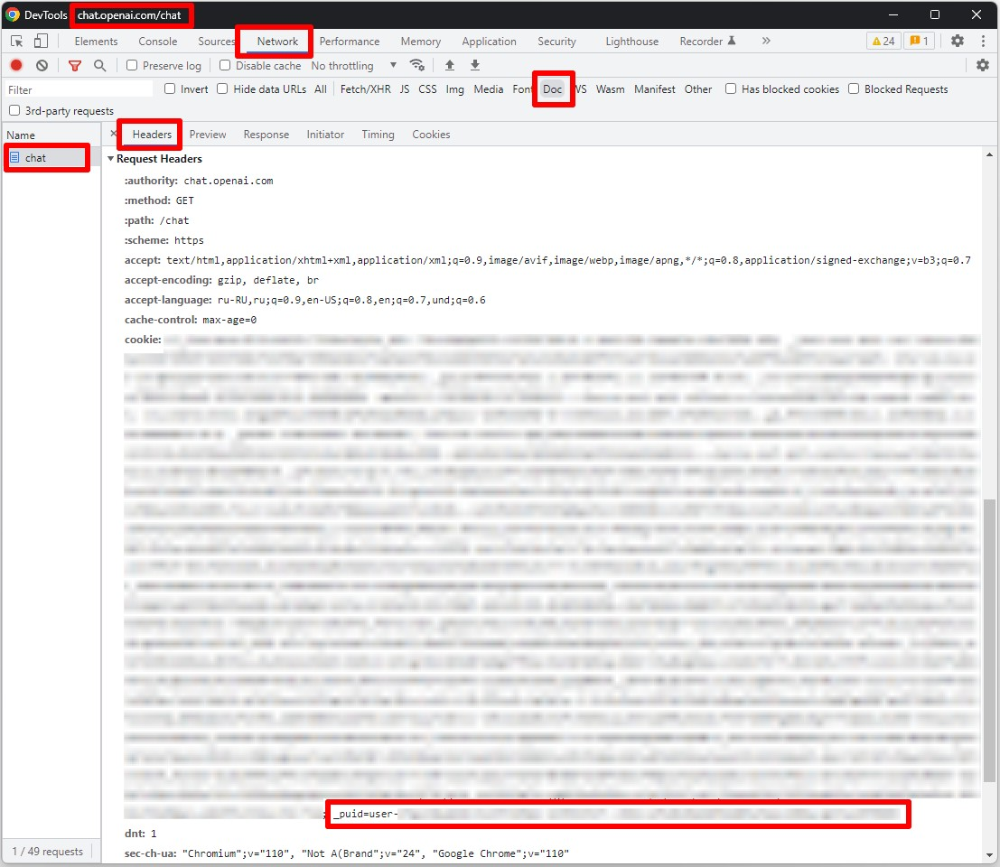

# ChatGPT-PHP-Example

A simple example of an API request and the output of messages to the browser

The code for this example was generated using ChatGPT

## Usage

To use the official API, add [OPENAI_API_KEY](https://platform.openai.com/account/api-keys) in the `openai_chat_api.php` file.

Additionally, to use the unofficial API from the [chat.openai.com/chat](https://chat.openai.com/chat) page, add `ACCESS_TOKEN` and `COOKIE_PUID` (only available for ChatGPT Plus users).

#### ACCESS_TOKEN:
Go to the page https://chat.openai.com/api/auth/session and copy the `accessToken`

#### COOKIE_PUID:
Go to the page https://chat.openai.com/chat, open the `DevTools` in your browser (`F12`) and copy the cookie `_puid=user-...`

