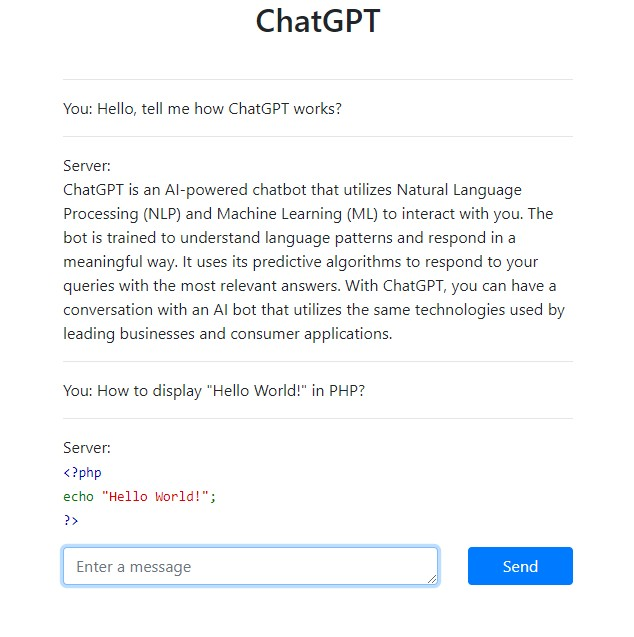

# ChatGPT-Example

A simple example of an API request and the output of messages to the browser

The code for this example was generated using ChatGPT

## Usage

In `openai_chat_api.php`, add the API key and/or cookie content `_puid` (available only for ChatGPT Plus users)
